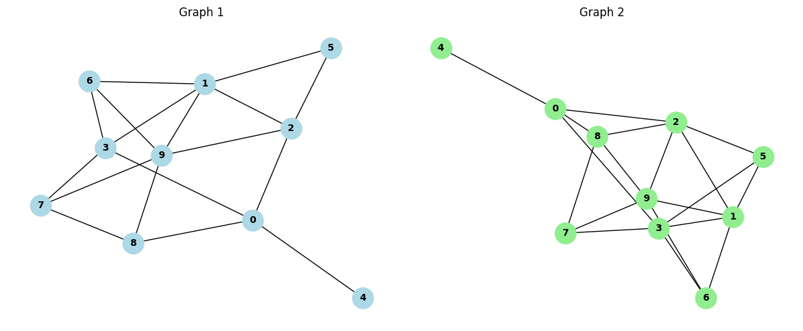

==============================================
Comparing Random Walk Stationary Distributions
==============================================

Introduction
============

The ``ComparingRandomWalkStationaryDistributions`` class is a Python implementation for comparing the stationary distributions of random walks on graphs. This class provides methods to compute and compare stationary distributions, perform random walks, and analyze the characteristics of these walks on different graph structures.

Understanding Graph Distances
=============================

In the context of graph theory and network analysis, the concept of "distance" between graphs is crucial for understanding structural similarities and differences. The ``Distance`` class focuses on one particular aspect: the behavior of random walks on these graphs.

A random walk on a graph is a stochastic process where a walker moves from node to node along the edges of the graph, choosing the next node randomly from the set of neighbors of the current node. The stationary distribution of a random walk represents the long-term probability of finding the walker at each node, assuming the walk continues indefinitely.

Formal Definition of Distance Metrics
=====================================

The ``Comparing Random Walk Stationary Distributions`` class implements three distance metrics for comparing stationary distributions:

1. L1 Distance (Manhattan Distance):

   .. math::

      d_{L1}(P, Q) = \sum_{i} |P_i - Q_i|

2. L2 Distance (Euclidean Distance):

   .. math::

      d_{L2}(P, Q) = \sqrt{\sum_{i} (P_i - Q_i)^2}

3. Kullback-Leibler (KL) Divergence:

   .. math::

      D_{KL}(P || Q) = \sum_{i} P_i \log(\frac{P_i}{Q_i})

Where :math:`P` and :math:`Q` are the stationary distributions of the two graphs being compared.

Key Features
============

1. Computation of stationary distributions
2. Comparison of stationary distributions using multiple distance metrics
3. Simulation of random walks on graphs
4. Analysis of random walk characteristics (average length, node visit frequencies)

Usage Example
=============

Here's a basic example of how to use the ``Distance`` class:

.. code-block:: python

  import networkx as nx
  import matplotlib.pyplot as plt
  from distancia import ComparingRandomWalkStationaryDistributions  

  # Create two similar but slightly different graphs
  G1 = nx.erdos_renyi_graph(10, 0.3, seed=42)
  G2 = nx.erdos_renyi_graph(10, 0.35, seed=42)

  # Initialize the Distance object
  distance = ComparingRandomWalkStationaryDistributions(G1, G2)

  # Compare the stationary distributions
  l1_distance = distance.compare_distributions(metric='l1')
  l2_distance = distance.compare_distributions(metric='l2')
  kl_distance = distance.compare_distributions(metric='kl')

  print(f"L1 distance between stationary distributions: {l1_distance:.4f}")
  print(f"L2 distance between stationary distributions: {l2_distance:.4f}")
  print(f"KL divergence between stationary distributions: {kl_distance:.4f}")

  # Compare random walks
  walk_comparison = distance.compare_random_walks(num_walks=1000, walk_length=20)

  # Print results
  for graph_name, results in walk_comparison.items():
      print(f"\nResults for {graph_name}:")
      print(f"Average walk length: {results['avg_walk_length']:.2f}")
      print("Node visit frequencies:")
      for node, freq in results['node_visit_frequencies'].items():
          print(f"  Node {node}: {freq:.4f}")

  # Visualize the graphs
  plt.figure(figsize=(12, 5))

  plt.subplot(121)
  nx.draw(G1, with_labels=True, node_color='lightblue', node_size=500, font_size=10, font_weight='bold')
  plt.title("Graph 1")

  plt.subplot(122)
  nx.draw(G2, with_labels=True, node_color='lightgreen', node_size=500, font_size=10, font_weight='bold')
  plt.title("Graph 2")

  plt.tight_layout()
  plt.show()

.. code-block:: bash
   L1 distance between stationary distributions: 0.1300
   L2 distance between stationary distributions: 0.0436
   KL divergence between stationary distributions: 0.0095
   Results for graph1:
   Average walk length: 20.00
   Node visit frequencies:
     Node 0: 0.1206
     Node 1: 0.1412
     Node 2: 0.1163
     Node 3: 0.1162
     Node 4: 0.0328
     Node 5: 0.0563
     Node 6: 0.0891
     Node 7: 0.0894
     Node 8: 0.0907
     Node 9: 0.1474

   Results for graph2:
   Average walk length: 20.00
   Node visit frequencies:
     Node 0: 0.1084
     Node 1: 0.1266
     Node 2: 0.1272
     Node 3: 0.1302
     Node 4: 0.0293
     Node 5: 0.0765
     Node 6: 0.0795
     Node 7: 0.0824
     Node 8: 0.1061
     Node 9: 0.1340

Academic References
===================
   :footcite:t:`comparingrandomwalkstationarydistributions1`:

   :footcite:t:`comparingrandomwalkstationarydistributions2`:

   :footcite:t:`comparingrandomwalkstationarydistributions3`:

.. footbibliography::

Conclusion
==========

The ``Distance`` class provides a powerful tool for comparing graphs based on the behavior of random walks. By analyzing the stationary distributions and characteristics of random walks, researchers and data scientists can gain insights into the structural similarities and differences between graphs. This approach has applications in various fields, including network analysis, community detection, and machine learning on graph-structured data.

Future work could involve extending the class to handle directed and weighted graphs, implementing more sophisticated distance metrics, or integrating this functionality into larger graph analysis frameworks.
