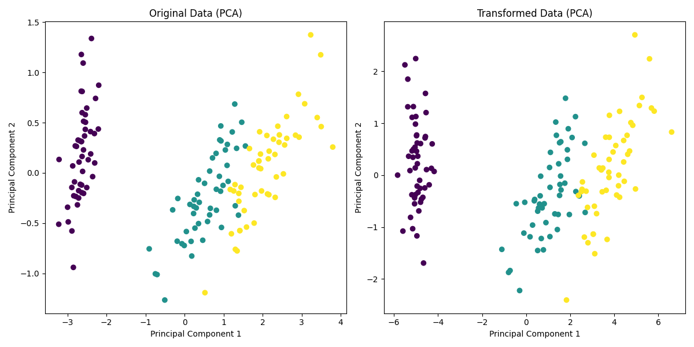

Distance Metric Learning
=======================

Introduction
------------

Distance Metric Learning (DML) is a subfield of machine learning focused on learning an optimal distance metric directly from data. Unlike traditional, predefined distance metrics like Euclidean or Manhattan distances, DML tailors the metric to the specific characteristics of the dataset and the particular machine learning task at hand, such as classification, clustering, or information retrieval. This adaptive approach often results in significantly improved performance, as the learned metric can better capture the underlying structure of the data.

Deeply Idea
-----------

The core idea of Distance Metric Learning is to transform the feature space in such a way that the distances between data points become more meaningful for a specific task. This transformation is usually learned by optimizing a loss function that reflects the desired properties of the distance metric.

For example, in a classification task, one might aim to minimize the distance between points that belong to the same class while maximizing the distance between points from different classes. This can be achieved by learning a linear transformation matrix \(M\), where the distance between two points \(x_i\) and \(x_j\) is defined as:

\[ d_M(x_i, x_j) = \sqrt{(x_i - x_j)^T M (x_i - x_j)} \]

Here, \(M\) is learned from the data, typically by solving a convex optimization problem. The learned matrix can be interpreted as reshaping the feature space, emphasizing the dimensions that are most informative for the task.

Several algorithms exist for Distance Metric Learning, each with different approaches and objectives. For instance:

- **Large Margin Nearest Neighbor (LMNN)**: Focuses on optimizing the k-nearest neighbors algorithm by learning a metric that ensures neighbors of the same class stay close, while points from different classes are pushed apart.
- **Information-Theoretic Metric Learning (ITML)**: Uses information theory to learn a distance metric that satisfies a set of pairwise distance constraints derived from the data.
- **Neighborhood Components Analysis (NCA)**: Aims to maximize the accuracy of nearest neighbor classification using a softmax over distances.

These methods enable the construction of a metric that is highly tuned to the data and the specific machine learning problem, leading to better model performance and more interpretable results.

.. code-block:: python

  from sklearn.datasets import load_iris
  from distancia import DistanceMetricLearning
  import numpy as np
  import matplotlib.pyplot as plt
  from sklearn.decomposition import PCA

  # Load the Iris dataset
  data, labels = load_iris(return_X_y=True)

  # Initialize the DistanceMetricLearning class with LMNN (Large Margin Nearest Neighbor)
  metric_learner = DistanceMetricLearning(data, labels, method='lmnn', k=3)

  # Fit the model to learn the metric
  metric_learner.fit()

  # Transform the data using the learned metric
  transformed_data = metric_learner.transform(data)

  # Print the first few rows of the transformed data
  print("Original Data (first 5 samples):")
  print(data[:5])

  print("\nTransformed Data (first 5 samples):")
  print(transformed_data[:5])

  # Plot the original and transformed data using PCA for visualization
  pca = PCA(n_components=2)
  data_2d = pca.fit_transform(data)
  transformed_data_2d = pca.fit_transform(transformed_data)

  # Original data plot
  plt.figure(figsize=(12, 6))

  plt.subplot(1, 2, 1)
  plt.scatter(data_2d[:, 0], data_2d[:, 1], c=labels, cmap='viridis')
  plt.title('Original Data (PCA)')
  plt.xlabel('Principal Component 1')
  plt.ylabel('Principal Component 2')

  # Transformed data plot
  plt.subplot(1, 2, 2)
  plt.scatter(transformed_data_2d[:, 0], transformed_data_2d[:, 1], c=labels, cmap='viridis')
  plt.title('Transformed Data (PCA)')
  plt.xlabel('Principal Component 1')
  plt.ylabel('Principal Component 2')

  plt.tight_layout()
  plt.show()

Explanation of the Example
Loading Data: The load_iris function from sklearn.datasets loads the well-known Iris dataset, which consists of features for three classes of flowers.

Initializing DistanceMetricLearning: The DistanceMetricLearning class is instantiated with the method 'lmnn' (Large Margin Nearest Neighbor), a popular metric learning algorithm.

Fitting and Transforming: The model is fitted to the data, and then the data is transformed using the learned metric.

Displaying Results: The original and transformed data are printed for comparison, showing how the data changes after applying the learned metric.

Visualization: The data is plotted in two dimensions using PCA (Principal Component Analysis) to visualize the effect of the metric learning. Two subplots compare the original and transformed data in a 2D space.

Output
Printed Output: Displays the first five samples of the original and transformed data, highlighting how the transformation affects the data.

Plot: Two scatter plots show the original and transformed data in 2D space. This visualization helps to see how the metric learning has altered the feature space, which can be crucial for tasks like classification.

.. image:: DistanceMetricLearning_2.png

This example provides a clear demonstration of how to use the DistanceMetricLearning class, including visualization of the results, which is essential for understanding the impact of the learned metric.

Academic Reference
------------------

  The concept of Distance Metric Learning has been explored in various seminal works. A key reference is the paper :cite:p:`distancemetriclearning1`   . This paper laid the groundwork for many subsequent methods in DML, introducing the idea of learning a distance metric based on pairwise constraints.

  Another influential work is :cite:p:`distancemetriclearning2`  , this paper introduced the LMNN algorithm, which has become one of the most widely used methods in distance metric learning, particularly in the context of k-nearest neighbor classification.

:footcite:t:``

.. footbibliography::

  distancemetriclearning1

  distancemetriclearning2

Conclusion
----------

Distance Metric Learning represents a powerful approach to enhancing the effectiveness of machine learning models by tailoring the distance metric to the specific characteristics of the data and task. By learning a distance metric that is optimized for a given problem, DML allows for more accurate and interpretable models, particularly in tasks where the notion of "distance" between data points is crucial.

The `DistanceMetricLearning` class in the `distancia` package provides a flexible interface for implementing various DML algorithms, making it a valuable tool for data scientists and researchers looking to improve model performance through customized distance metrics. By integrating DML into your machine learning workflow, you can leverage the power of adaptive distance metrics to achieve superior results.
