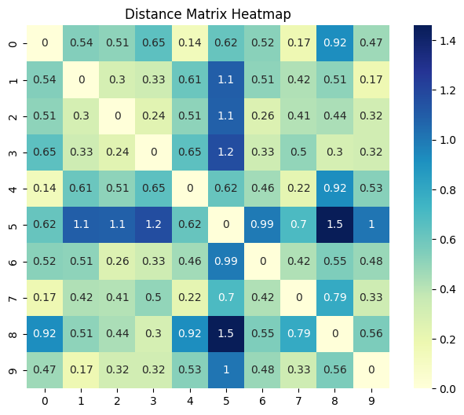
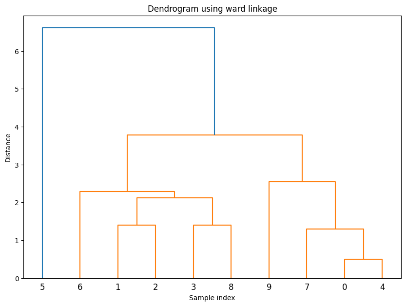
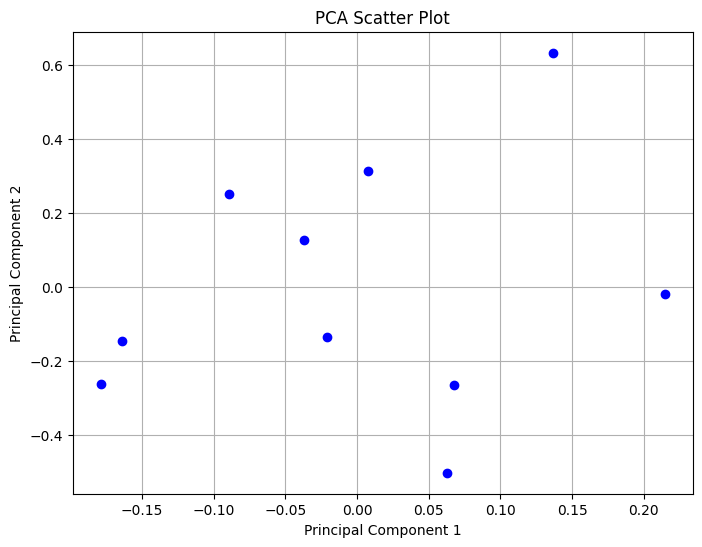

Visualization
==================

Introduction
------------

The `Visualization` class in the `distancia` package is designed to provide users with powerful and intuitive visualization tools for analyzing distance matrices. This class offers methods to visualize the relationships between data points through various plots, including heatmaps, dendrograms for hierarchical clustering, and 2D/3D scatter plots based on Principal Component Analysis (PCA).

The ability to visualize distance matrices is essential for exploratory data analysis (EDA), as it allows users to gain insights into the underlying structure of their datasets. By leveraging these visual tools, users can identify patterns, clusters, and anomalies within their data, facilitating better decision-making and model development.

Formula and Concepts
--------------------

The `Visualization` class is centered around visualizing distance matrices, which are square matrices representing pairwise distances between data points. Given a distance matrix `D`, where each entry `D[i][j]` represents the distance between the `i-th` and `j-th` data points, the class provides the following visualization options:

- **Heatmap**: A graphical representation of the distance matrix, where each cell's color intensity represents the magnitude of the corresponding distance value.
  
- **Dendrogram**: A tree-like diagram representing the hierarchical clustering of data points based on their pairwise distances. The dendrogram is generated using a linkage method such as 'ward', 'single', or 'complete'.
  
- **PCA Scatter Plot**: A plot showing data points in 2D or 3D space after dimensionality reduction using PCA. This plot helps in understanding the data's variance and structure in a lower-dimensional space.

Usefulness and Application
--------------------------

The `Visualization` class is useful in various scenarios:

1. **Exploratory Data Analysis (EDA)**: Visualization helps users quickly grasp the structure of their data, detect clusters, and identify outliers. This is particularly valuable in unsupervised learning tasks like clustering.

2. **Hierarchical Clustering**: The dendrogram plot provides a clear visualization of the hierarchical relationships between data points, which is essential in tasks like hierarchical clustering.

3. **Dimensionality Reduction**: The PCA scatter plot allows users to reduce the dimensionality of their data while preserving the most important variance, making it easier to visualize complex datasets.

Example usage
-------------

.. code-block:: python

  # Assume `dist_matrix` is a 2D list or array of distances and `labels` is a list of point labels
  dist_matrix = [[0, 1, 2], [1, 0, 1.5], [2, 1.5, 0]]
  labels = ['A', 'B', 'C']

  vis_tool = Visualization(dist_matrix, labels=labels)
  vis_tool.plot_heatmap()
  vis_tool.plot_dendrogram()
  vis_tool.plot_pca(n_components=2)

Academic Reference
------------------

The concept of distance matrices and their visualization has been widely discussed in the literature. One of the foundational references is:

:footcite:t:``

.. footbibliography::

- Johnson, S. C. (1967). "Hierarchical clustering schemes." *Psychometrika*, 32(3), 241-254. This paper discusses hierarchical clustering techniques and their applications, including the visualization of clustering results using dendrograms.

Conclusion
----------

The `DistanceMatrixPlot` class is a powerful tool for any data scientist or researcher working with distance-based analyses. By providing intuitive visualizations of distance matrices, this class makes it easier to explore, understand, and communicate the structure and relationships within datasets. Whether you're working on clustering, dimensionality reduction, or simply exploring your data, `DistanceMatrixPlot` adds significant value to your analysis toolkit.
